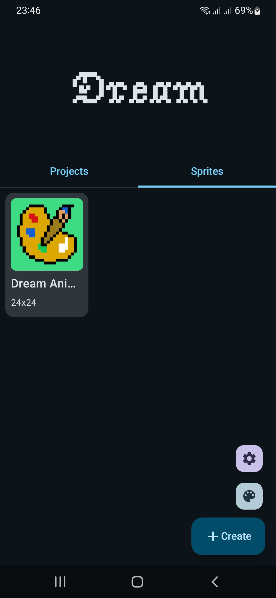
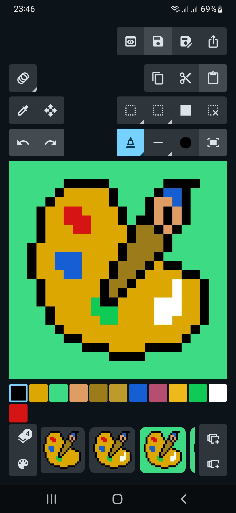
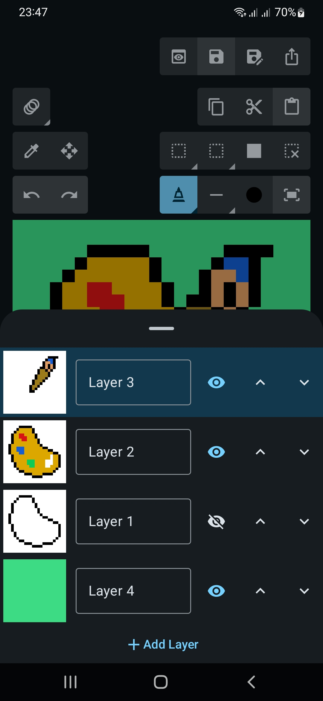
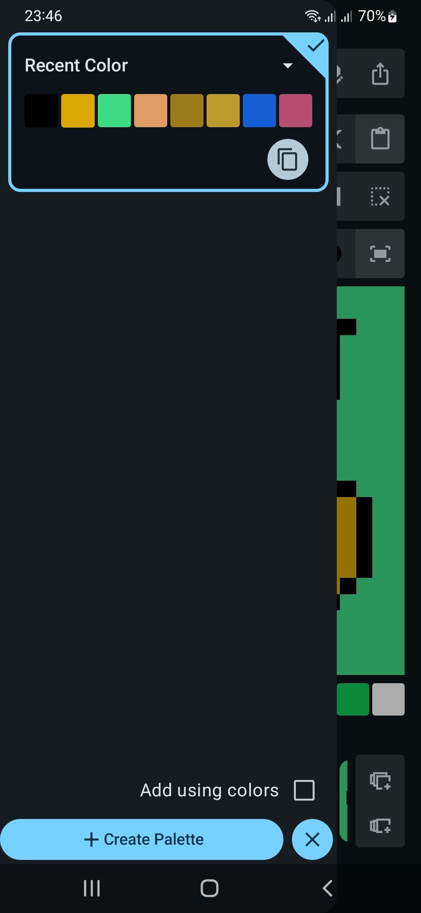

# 🎨 Pixel Art Animation App

A lightweight and intuitive app for creating pixel art and animations — perfect for game designers, hobbyists, and digital artists!

## ✨ Features

- 🖌️ Draw pixel art on a customizable canvas (e.g., 16x16, 32x32, 64x64)
- 🎞️ Frame-by-frame animation timeline
- 🧰 Tools: pencil, eraser, fill, color picker, selection
- 🌈 Color palette with HSV and RGB support
- 📂 Import/export to PNG (as strip or individual)
- 📁 Save projects locally
- 🧮 Onion skinning to assist with animation
- 🔁 Playback preview
- 🌙 Dark mode support

## 📱 Platforms

Available for:  
✅ Android (Mobile Only)

## 📲 Download & Install

You can download the latest version of the app directly from the **[Releases](../../releases)** section of this repository.

### Steps

1. Go to the [**Releases**](../../releases) page.  
2. Find the latest release.  
3. Download the `.apk` file (for example: app-release.apk`).  
4. On your Android device:
   - Open **Settings → Security → Install unknown apps**, and enable it for your browser or file manager (if needed).  
   - Tap the downloaded APK file to install it.  
5. Launch the app and enjoy! 🎉

## Android Studio Setup
1. Clone the repository
```bash
git clone https://github.com/suredesm/dream-pixel.git
cd dream-pixel
```
2. Open the project in Android Studio.

3. Build and run on an emulator or a physical device.

## 🧑‍🎨 Usage

1. Create project an create sprite under the project or directly in Home.
2. Use the edit tools to draw, erase, and fill.
3. Add or duplicate frames in the timeline.
4. Use onion skinning to align animations.
5. Tap "Preview" to play the animation.
6. Export as `.png`.

## 📸 Screenshots

<div style="display: grid; grid-template-columns: repeat(2, 1fr); gap: 10px;">
    
    
    
    
</div>

## 🤝 Contributing

Contributions are welcome!  
Please fork the repo and submit a pull request. For major changes, open an issue first to discuss your proposal.

1. Fork it
2. Create your feature branch (`git checkout -b feature/my-feature`)
3. Commit your changes (`git commit -am 'Add new feature'`)
4. Push to the branch (`git push origin feature/my-feature`)
5. Open a pull request

## 📄 License

MIT License. See [`LICENSE`](./LICENSE) for more info.

## 💬 Contact

For questions or suggestions, open an issue or reach out via dreamartpixel@gmail.com.
